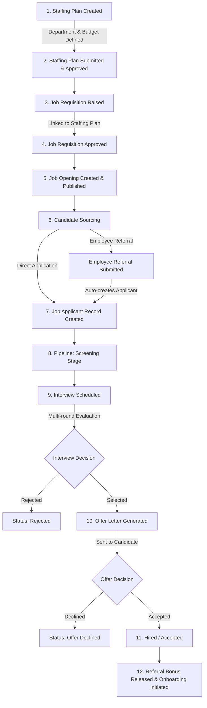

# PulseWork Chrono (PWChrono) — Enterprise HRMS & Partner Portal

PulseWork Chrono is an enterprise-grade Human Resource Management System (HRMS) and Partner Portal built natively on Salesforce. It pairs a **Salesforce DX** backend with an **Experience Cloud** digital experience, delivering a high-performance modern web application powered by **Lightning Web Components (LWC)** and styled with the **SmartHR** UI framework (Bootstrap 5, FontAwesome 6, Tabler Icons, Feather Icons).

---

## Table of Contents
1. [Architecture & Technology Stack](#1-architecture--technology-stack)
2. [End-to-End Recruitment Process Lifecycle](#2-end-to-end-recruitment-process-lifecycle)
3. [Recruitment Data Model & Schema Mappings](#3-recruitment-data-model--schema-mappings)
4. [Component Inventory](#4-component-inventory)
   - [Lightning Web Components (LWCs)](#lightning-web-components-lwcs)
   - [Apex Classes & Services](#apex-classes--services)
5. [Security & Guest User Authentication Model](#5-security--guest-user-authentication-model)
6. [Zero-FOUC (Flash of Unstyled Content) Engine](#6-zero-fouc-flash-of-unstyled-content-engine)
7. [End-to-End Testing & Operational Verification](#7-end-to-end-testing--operational-verification)
8. [Deployment & CLI Commands](#8-deployment--cli-commands)

---

## 1. Architecture & Technology Stack

```
+-----------------------------------------------------------------------------------+
|                           Experience Cloud Portal / LWR                          |
|  +-----------------------------------------------------------------------------+  |
|  |                            pwchronoMainLayout                               |  |
|  |      [Zero-FOUC Loading Shield] -> [pwchronoHeader] + [pwchronoSidebar]     |  |
|  +-----------------------------------------------------------------------------+  |
|                                         |                                         |
|                               [Page Content Slot]                                 |
|                                         |                                         |
|  +-----------------------------------------------------------------------------+  |
|  |                             pwchronoRecruitment                             |  |
|  |  +-----------------------------------------------------------------------+  |  |
|  |  | Top KPI Summary Cards (Openings, Requisitions, Applicants, Offers, etc.) |  |  |
|  |  +-----------------------------------------------------------------------+  |  |
|  |  | 7 Tab Workspaces:                                                     |  |  |
|  |  | [1. Pipeline]   [2. Openings]   [3. Requisitions]   [4. Staffing Plans] |  |  |
|  |  | [5. Interviews] [6. Offers]     [7. Referrals]                        |  |  |
|  |  +-----------------------------------------------------------------------+  |  |
|  +-----------------------------------------------------------------------------+  |
+-----------------------------------------------------------------------------------+
                                         |
                            (AuraEnabled / Wire Service)
                                         v
+-----------------------------------------------------------------------------------+
|                              Apex Controller Layer                                |
|  - PWChrono_RecruitmentController   (without sharing + Guest Session Verification)|
|  - PWChrono_StaffingPlanController  (without sharing + Safe Untyped Deserializer) |
|  - PWChrono_JobRequisitionController(without sharing + Safe Untyped Deserializer) |
|  - PWChrono_EmployeeReferralController (without sharing + Safe Lookups)           |
+-----------------------------------------------------------------------------------+
                                         |
                                         v
+-----------------------------------------------------------------------------------+
|                        Business Logic & Service Layer                             |
|  - PWChrono_RecruitmentService      (Core CRUD, Validation, Status Transitions)   |
|  - PWChrono_GuestSession            (Programmatic Token & User Context Validation)|
|  - PWChrono_AccessController        (Feature & Role Entitlements)                 |
+-----------------------------------------------------------------------------------+
                                         |
                                         v
+-----------------------------------------------------------------------------------+
|                          Salesforce Custom Schema                                 |
|  Staffing Plans | Requisitions | Openings | Applicants | Interviews | Offers      |
+-----------------------------------------------------------------------------------+
```

- **Frontend Runtime**: Salesforce Lightning Web Components (LWC) operating in `light` render mode for high compatibility with standard CSS frameworks.
- **Styling Framework**: SmartHR modern HR theme, Bootstrap 5 grid and utility classes, FontAwesome 6 Free, Tabler Icons, Feather Icons.
- **Backend**: Apex Enterprise Layered Architecture (Controllers -> Services -> Domain/Data Schema).
- **Guest Experience**: Custom OTP-based tokenized session engine utilizing `Portal_Users__c` and `PWChrono_GuestSession`.

---

## 2. End-to-End Recruitment Process Lifecycle

The Recruitment module in PulseWork Chrono maps the complete, end-to-end talent acquisition lifecycle across 8 interconnected phases:



### Phase 1: Workforce Planning & Staffing Plans (Tab 4)
- **Objective**: Establish departmental hiring quotas and budgets for an upcoming quarter or financial year.
- **Flow**:
  1. HR Admin creates a new **Staffing Plan** (`PWChrono_Staffing_Plan__c`) specifying Company, Department, From Date, To Date, and Status (`Draft`).
  2. Adds multiple **Staffing Plan Detail** lines (`PWChrono_Staffing_Plan_Detail__c`) specifying the Designation, Vacancies count, and Estimated Cost Per Position.
  3. Total estimated budget is calculated automatically (`Vacancies * Cost Per Position`).
  4. Plan is submitted and moved to `Submitted` or `Approved`.

### Phase 2: Job Requisitions (Tab 3)
- **Objective**: Request permission to open specific roles tied to approved staffing plans.
- **Flow**:
  1. Department heads or HR create a **Job Requisition** (`PWChrono_Job_Requisition__c`).
  2. The requisition is linked to an active **Department**, **Designation**, and an approved **Staffing Plan**.
  3. Hiring rationale (`Reason_for_Hiring__c`), expected compensation, and target date (`Expected_By_Date__c`) are set.
  4. Workflow moves status from `Pending` -> `Open & Approved` or `Rejected`.

### Phase 3: Job Openings (Tab 2)
- **Objective**: Publicly or internally advertise approved vacancies.
- **Flow**:
  1. An approved requisition spawns an active **Job Opening** (`PWChrono_Job_Opening__c`).
  2. Status is set to `Open`.
  3. Displays in the **Job Openings Viewer** card grid showing position title, department, open positions count, and closing date.

### Phase 4: Sourcing & Employee Referrals (Tabs 2 & 7)
- **Objective**: Source candidates directly or incentivize existing staff through employee referrals.
- **Flow**:
  1. **Direct Application**: Candidates apply to a Job Opening, creating a `PWChrono_Job_Applicant__c` with status `Applied`.
  2. **Employee Referral**: An active employee clicks **Refer** on any Job Opening or opens the **Employee Referrals** tab.
  3. Entering candidate details calls `PWChrono_RecruitmentController.referCandidate`.
  4. The service automatically creates a `PWChrono_Job_Applicant__c` with `Referrers__c` set to the referring employee, preventing duplicate email applications per opening.
  5. An `PWChrono_Employee_Referral__c` record tracks the referral bonus amount and bonus payment status.

### Phase 5: Candidate Pipeline Kanban (Tab 1)
- **Objective**: Visual tracking and progression of all applicants across hiring stages.
- **Stages**:
  - `Applied` -> Initial application received.
  - `Screening` -> Resume evaluation and initial HR check.
  - `Interview Scheduled` -> One or more interviews booked.
  - `Selected` -> Candidate cleared interviews; recommended for hire.
  - `Offer Extended` -> Formal offer letter issued.
  - `Accepted` -> Candidate accepted offer (Hired).
  - `Rejected` -> Candidate disqualified.
- **Interaction**: Drag-and-drop or status updates update `PWChrono_Job_Applicant__c.Status__c` in real-time via `updateApplicantStatus`.

### Phase 6: Interview Scheduler (Tab 5)
- **Objective**: Coordinate interview rounds between candidates and internal team members.
- **Flow**:
  1. HR selects an applicant and chooses the interview round:
     - *Screening*
     - *Technical Round 1*
     - *Technical Round 2*
     - *HR Round*
     - *Final Round*
  2. System retrieves eligible active interviewers (`Portal_Users__c`) via `getPotentialInterviewers`.
  3. Interview date, time, mode (In-person, Video Call, Phone), and meeting link are specified.
  4. Saves a `PWChrono_Interview__c` record and transitions applicant status to `Interview Scheduled`.

### Phase 7: Offer Letter Generation (Tab 6)
- **Objective**: Generate structured compensation packages and formal employment offers.
- **Flow**:
  1. HR selects an applicant who has cleared interviews (`Selected`).
  2. Enters designation, annual Offered CTC, joining date, and offer expiration date.
  3. Triggers `generateOfferLetter`:
     - Creates `PWChrono_Offer_Letter__c` with status `Sent`.
     - Automatically updates `PWChrono_Job_Applicant__c.Status__c` to `Offer Extended`.
     - Updates KPI summary cards immediately.

### Phase 8: Onboarding & Referral Payout
- Upon candidate acceptance (`Accepted`), the applicant transitions to employee provisioning.
- If the candidate was an employee referral, the `PWChrono_Employee_Referral__c.Referral_Bonus_Payment_Status__c` is approved for payroll release.

---

## 3. Recruitment Data Model & Schema Mappings

| SObject API Name | Label | Key Fields | Relationships |
| :--- | :--- | :--- | :--- |
| `PWChrono_Staffing_Plan__c` | Staffing Plan | `Name`, `Company__c`, `From_Date__c`, `To_Date__c`, `Status__c`, `Total_Estimated_Cost__c`, `Notes__c` | Lookup -> `PWChrono_Department__c`<br>Lookup -> `Portal_Users__c` (`Requested_By__c`) |
| `PWChrono_Staffing_Plan_Detail__c` | Staffing Plan Detail | `Vacancies__c`, `Estimated_Cost_Per_Position__c`, `Total_Estimated_Cost__c`, `Number_of_Positions__c` | Master-Detail -> `PWChrono_Staffing_Plan__c`<br>Lookup -> `PWChrono_Designation__c` |
| `PWChrono_Job_Requisition__c` | Job Requisition | `Name`, `No_of_Positions__c`, `Expected_Compensation__c`, `Status__c`, `Expected_By_Date__c`, `Posting_Date__c`, `Reason_for_Hiring__c`, `Job_Description__c` | Lookup -> `PWChrono_Department__c`<br>Lookup -> `PWChrono_Designation__c`<br>Lookup -> `PWChrono_Staffing_Plan__c`<br>Lookup -> `Portal_Users__c` |
| `PWChrono_Job_Opening__c` | Job Opening | `Name`, `No_of_Positions__c`, `Status__c` (`Draft`, `Open`, `Closed`), `Closing_Date__c`, `Job_Description__c` | Lookup -> `PWChrono_Department__c`<br>Lookup -> `PWChrono_Designation__c`<br>Lookup -> `PWChrono_Job_Requisition__c` |
| `PWChrono_Job_Applicant__c` | Job Applicant | `Name`, `Email__c`, `Phone__c`, `Experience_Years__c`, `Status__c`, `Resume__c` | Lookup -> `PWChrono_Job_Opening__c`<br>Lookup -> `Portal_Users__c` (`Referrers__c`) |
| `PWChrono_Interview__c` | Interview | `Interview_Round__c`, `Interview_Date__c`, `Interview_Time__c`, `Interview_Type__c`, `Result__c` (`Pending`, `Pass`, `Fail`), `Comments__c` | Lookup -> `PWChrono_Job_Applicant__c`<br>Lookup -> `Portal_Users__c` (`Interviewer__c`) |
| `PWChrono_Offer_Letter__c` | Offer Letter | `Offered_CTC__c`, `Joining_Date__c`, `Offer_Date__c`, `Expiry_Date__c`, `Status__c` (`Draft`, `Sent`, `Accepted`, `Declined`) | Lookup -> `PWChrono_Job_Applicant__c`<br>Lookup -> `PWChrono_Designation__c` |
| `PWChrono_Employee_Referral__c` | Employee Referral | `Full_Name__c`, `Email__c`, `Mobile_Number__c`, `Status__c`, `Referral_Bonus_Amount__c`, `Referral_Bonus_Payment_Status__c`, `Is_Applicable_for_Referral_Bonus__c` | Lookup -> `PWChrono_Designation__c`<br>Lookup -> `PWChrono_Job_Applicant__c`<br>Lookup -> `Portal_Users__c` (`Current_Employee__c`) |
| `PWChrono_Department__c` | Department | `Name`, `Is_Active__c`, `Department_Code__c` | Self-lookup -> Parent Department |
| `PWChrono_Designation__c` | Designation | `Name`, `Is_Active__c`, `Designation_Code__c` | Lookup -> `PWChrono_Department__c` |
| `Portal_Users__c` | Portal User | `Name`, `Email__c`, `Role__c`, `Is_Active__c`, `Access_Features__c`, `Session_Token__c` | Links to external or employee identity |

---

## 4. Component Inventory

### Lightning Web Components (LWCs)

```
force-app/main/default/lwc/
├── pwchronoMainLayout/            # Master layout shell: zero-FOUC loader, header, sidebar
├── pwchronoUiAssets/              # Stylesheet orchestrator: loads Bootstrap & SmartHR CSS
├── pwchronoRecruitment/           # Root Recruitment workspace: KPI summary cards & 7 tabs
├── pwchronoRecruitmentPipeline/   # Tab 1: Interactive drag-and-drop Kanban candidate board
├── pwchronoJobOpeningsViewer/     # Tab 2: Job openings directory with candidate referral modal
├── pwchronoJobRequisition/        # Tab 3: Requisition manager with approval controls
├── pwchronoStaffingPlan/          # Tab 4: Headcount planning, cost matrix & detail lines
├── pwchronoInterviewScheduler/    # Tab 5: Multi-round interview coordinator & schedule cards
├── pwchronoOfferLetterGenerator/  # Tab 6: Formal offer letter builder with CTC calculations
└── pwchronoEmployeeReferral/      # Tab 7: Employee referral submission & bonus status tracker
```

### Apex Classes & Services

```
force-app/main/default/classes/
├── PWChrono_RecruitmentController.cls       # API entrypoint for Pipeline, Openings, Interviews, Offers
├── PWChrono_RecruitmentController_Test.cls  # Automated unit tests for Recruitment Controller
├── PWChrono_RecruitmentService.cls          # Business logic: candidate referral, pipeline metrics, CRUD
├── PWChrono_StaffingPlanController.cls      # API entrypoint for Staffing Plans & detail line upserts
├── PWChrono_StaffingPlanController_Test.cls # Automated unit tests for Staffing Plan Controller
├── PWChrono_JobRequisitionController.cls    # API entrypoint for Job Requisitions & approval statuses
├── PWChrono_JobRequisitionController_Test.cls# Automated unit tests for Job Requisition Controller
├── PWChrono_EmployeeReferralController.cls  # API entrypoint for Employee Referrals & bonus queries
├── PWChrono_EmployeeReferralController_Test.cls# Automated unit tests for Employee Referral Controller
├── PWChrono_GuestSession.cls               # Secure guest user verification & token validator
├── PWChrono_AuthController.cls              # OTP dispatch, login bootstrap, user context
├── PWChrono_AccessController.cls            # Granular feature gating & permissions
├── PWChrono_Constants.cls                   # Centralized statuses, roles, limits, currency codes
├── PWChrono_Logger.cls                      # Structured application exception logging
└── PWChrono_Utils.cls                       # Helper utilities for record mapping & context
```

---

## 5. Security & Guest User Authentication Model

### The Challenge with Guest User Execution
In Salesforce Experience Cloud sites where unauthenticated guest access or custom OTP authentication is used:
1. Guest Users default to strict `with sharing` constraints under standard platform sharing rules.
2. Standard Guest Users cannot run DML operations inside `@AuraEnabled(cacheable=true)` methods.
3. Reference and lookup fields to standard `User` or `Portal_Users__c` throw security violations if queried under restrictive guest contexts.

### The PWChrono Solution
1. **`public without sharing` Service Boundary**:
   Controllers handling recruitment workflows are declared `public without sharing class`. This provides the necessary system elevation to read departments, designations, and create applicants.
2. **Programmatic Session Token Validation**:
   Instead of relying on standard platform session cookies (which do not exist for Guests), the frontend passes `portalUserId` and `sessionToken`.
   The controller performs a non-DML verification against `Portal_Users__c`:
   ```apex
   if (UserInfo.getUserType() == 'Guest') {
     if (String.isBlank(portalUserId)) return;
     List<Portal_Users__c> users = [
       SELECT Id, Role__c, Access_Features__c, Is_Active__c
       FROM Portal_Users__c
       WHERE Id = :portalUserId AND Is_Active__c = true
       LIMIT 1
     ];
     if (users.isEmpty()) {
       throw new AuraHandledException('Session invalid or expired.');
     }
   }
   ```
3. **Safe Untyped JSON Deserialization**:
   Standard `JSON.deserialize(json, SObject.class)` crashes when empty string dates (`""`) or empty string lookups are passed from HTML forms. PWChrono uses `JSON.deserializeUntyped` to sanitize all empty strings to `null` before constructing SObjects:
   ```apex
   Map<String, Object> raw = (Map<String, Object>) JSON.deserializeUntyped(planJson);
   if (raw.containsKey('From_Date__c') && String.isNotBlank(String.valueOf(raw.get('From_Date__c')))) {
     plan.From_Date__c = Date.valueOf(String.valueOf(raw.get('From_Date__c')));
   }
   ```

---

## 6. Zero-FOUC (Flash of Unstyled Content) Engine

### Problem
When the portal loads, static resource CSS bundles (`bootstrap.min.css`, `style.css`) load asynchronously via `loadStyle`. Prior to CSS initialization, the browser displays raw, unstyled HTML elements (stacked `<ul>` tabs, unbordered tables, misaligned icons), creating an unpolished visual jump.

### Solution Architecture
Implemented inside `pwchronoMainLayout`:
1. **Immediate Root Preload**: `<c-pwchrono-ui-assets onassetsready={handleAssetsReady}>` is placed at the top level of the template so resource requests initiate on frame zero.
2. **Native SVG Loading Shield (`#pwchrono-global-loader`)**:
   A fullscreen overlay styled with inline CSS and an animated SVG gradient spinner (`#fc6075` to `#ff9b44`) using SVG `<animateTransform>`. Because it requires zero external CSS, it animates immediately on the very first frame.
3. **Visibility Shield (`mainWrapperStyle`)**:
   The entire `.main-wrapper` remains `visibility: hidden; opacity: 0; pointer-events: none;` until both `isUiReady` (styles loaded) and `isAuthChecked` (session verified) resolve.
4. **Seamless Reveal**: Once ready, the loader smoothly fades out and the styled UI appears with an elegant 0.25-second transition. A 2.5-second safety timer guarantees that the UI reveals even on slow networks.

---

## 7. End-to-End Testing & Operational Verification

### Automated Execution via Salesforce CLI
You can execute an anonymous Apex script to test all 7 recruitment tabs synchronously against your target org:

```powershell
sf apex run -f "scripts/apex/test_recruitment_flow.apex"
```

### Manual Verification Checklist (Portal UI)

1. **Top Dashboard Metrics**:
   - Open `/PulseWorkChrono/` -> navigate to **Recruitment Process**.
   - Verify that the 6 KPI cards (Openings, Requisitions, Applicants, Interviews, Offers, Hired) display accurate numerical counts.
2. **Staffing Plans (Tab 4)**:
   - Click **New Staffing Plan**.
   - Confirm **Department** dropdown loads options (`Engineering`, `Sales`, `Human Resources`).
   - Add a detail row, select Designation (`Senior Developer`), enter vacancies and cost per position.
   - Click **Save** -> Verify plan appears in the table with formatted currency and status badge.
3. **Job Requisitions (Tab 3)**:
   - Click **New Requisition**.
   - Select Department, Designation, and link to the newly created Staffing Plan.
   - Save and verify status updates to `Open & Approved`.
4. **Job Openings (Tab 2)**:
   - View open job cards.
   - Click **Refer** on an opening, enter candidate details (First Name, Last Name, Email, Phone, Experience).
   - Click **Submit Referral** -> Verify success toast.
5. **Candidate Pipeline (Tab 1)**:
   - Refresh the pipeline. Confirm the referred candidate appears under the `Applied` column.
   - Drag candidate card to `Screening`, then `Selected`.
6. **Interview Scheduler (Tab 5)**:
   - Click **Schedule Interview**.
   - Select candidate, round (`Technical Round 1`), interviewer from dropdown, and date/time.
   - Save -> Verify interview card appears in the scheduled list.
7. **Offer Letters (Tab 6)**:
   - Select candidate from dropdown (must be in `Selected` stage).
   - Enter Offered CTC, joining date, and expiration date.
   - Click **Generate & Send Offer Letter** -> Verify success toast and applicant stage updates to `Offer Extended`.
8. **Employee Referrals (Tab 7)**:
   - Verify that the referral appears in the table with bonus amount and payment status.

---

## 8. Deployment & CLI Commands

### Deploy All Recruitment Components
```powershell
sf project deploy start -m "ApexClass:PWChrono_RecruitmentController,ApexClass:PWChrono_RecruitmentController_Test,ApexClass:PWChrono_RecruitmentService,ApexClass:PWChrono_StaffingPlanController,ApexClass:PWChrono_StaffingPlanController_Test,ApexClass:PWChrono_JobRequisitionController,ApexClass:PWChrono_JobRequisitionController_Test,ApexClass:PWChrono_EmployeeReferralController,ApexClass:PWChrono_EmployeeReferralController_Test,LightningComponentBundle:pwchronoRecruitment,LightningComponentBundle:pwchronoRecruitmentPipeline,LightningComponentBundle:pwchronoJobOpeningsViewer,LightningComponentBundle:pwchronoJobRequisition,LightningComponentBundle:pwchronoStaffingPlan,LightningComponentBundle:pwchronoInterviewScheduler,LightningComponentBundle:pwchronoOfferLetterGenerator,LightningComponentBundle:pwchronoEmployeeReferral,LightningComponentBundle:pwchronoMainLayout" -l NoTestRun
```

### Run Unit Tests
```powershell
sf apex test run -c -r human -n "PWChrono_RecruitmentController_Test,PWChrono_StaffingPlanController_Test,PWChrono_JobRequisitionController_Test,PWChrono_EmployeeReferralController_Test"
```

### Open Target Org
```powershell
sf org open -p "/lightning/n/PWChrono_Recruitment"
```

---

## Authors & Maintenance
- **Repository**: `demo-partner`
- **Project**: The Lodestone Group / PulseWork Chrono
- **Salesforce API Version**: 67.0

